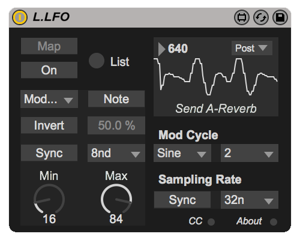

# L.LFO

> Advanced LFO

The LFO is by far my favorite utility in production. I love the modularity of it.
When time came to get my feet wet with Max I had no doubts as to what my first
project would be. There are quite of few M4L LFOs out there, but in every case
there was something I didn't like, or a feature I didn't have.
For my own artistic needs I wanted something that was compact - so I could route
LFOs to LFOs and so on - all without having to navigate too much.
I also needed something that could produce more interesting waveforms than the
standard Sine, Triangle, Square, Saw, Noise.

## Features

+ **Classic Waveforms** -
  `Sine`, `Triangle`, `Saw`, `Square`, `RandomStep`, `RandomSmooth`
+ **Waveform Inversion** -
  make a Saw ramp downward instead of upward, for example
+ **Hz or Synced modes** -
  `Synced` mode from `128n` up to `32` bars
  (or more with `Mod Cycle` - see further below)
+ **Note Trigger** -
  When enabled, LFO phase resets on each incoming MIDI Note On message
  (this is why L.LFO is a MIDI Effect; Audio Effects cannot receive MIDI
  without sloppy workarounds)
+ **Pulse Width** -
  control of Square, or "Point Whereabouts" of Triangle
  waveform. `PW` is typical for the Square. `PW` for Triangle at 50% will produce...
  a triangle, with the point in the center. At 0% you will have a Saw ramping
  down; at 100% it will ramp up.
+ **ModCycle** -
  This is where L.LFO steps away from being a generic effect to
  an advanced modulation device. The same premise behind FM
  synthesis, or routing an LFO to itself, or routing an LFO to another LFO,
  is what's behind this. Modulate a carrier wave (the `XShape` param)
  with a rate-multiplied Sine wave (set by the `XRate` param).
  `XRate = Rate * XRate`. For example, if your `Rate` is set to `1n`
  (1 bar), and your `XRate` is set to `8`, you will have a greater modulation
  that cycles every 8 bars, with 1n modulations fading in and out accordingly.
  The `XRate` can also be smaller than the `Rate` (when `XRate` < 1.),
  which creates sub-divisions. A waveform scope is included on the device to
  better aid using this option.
+ **SR (Sampling Rate) control** - The ultimate effect of
  this is like a square wave version of `Mod Cycle`, though it works
  differently, the end result in similar. The LFO engine is producing an
  audio-rate signal that is being sampled every 1 millisecond to produce usable
  control data. By making the sample rate slower, we are effectively applying a
  sort of bit reduction, adding tiny steps to our output waveform.
  The `SrRate` can be set in ms, or for more musical purposes as note-values
  just like the synced LFO. If you have a sine at `1n`, and set the `SrRate` to
  `16n`, you will end up with a down-sampled sine wave modulation that only
  moves in `16n` increments - very cool for musical purposes.
  All sorts of staircases can be made, though often phase
  cancelation can happen depending on your settings. Use this along with `Mod Cycle`
  to create extra crazy shapes!
+ **Other features** -
  + Destination Min and Max
  + Instant mapping or List-browse (old school style) mapping
  + very-low CPU consumption
  + very compact UI so you can have like 5 of these side by side and still be
    able to see their settings
  + MIDI-to-CC
  + Info View help (hover over any parameter while Live's info view is open
    for detailed descriptions)

## Download

> Note that releases marked as _beta_, _alpha_, or _pre-release_ may not be
production ready

### v4.1.0-beta

+ [L.LFO.amxd](https://github.com/Lokua/L.LFO/releases/download/v4.1.0-beta/L.LFO.amxd)
+ [Source (zip)](https://github.com/Lokua/L.LFO/archive/v4.1.0-beta.zip)
+ [Source (tar.gz)](https://github.com/Lokua/L.LFO/archive/v4.1.0-beta.tar.gz)

### v3.2.0 (legacy)
+ [zip](https://s3.amazonaws.com/lokua.net.for-live/L.LFO/3.2.0/L.LFO.v3.2.0.zip)

---

Find more free devices at [Lokua.net/for-live][l4l]

## License
MIT © [Joshua Kleckner][jjk]

[jjk]: https://lokua.net
[l4l]: https://lokua.net/for-live
[m4l]: https://www.ableton.com/en/live/max-for-live/
[lfo]: https://lokua.net/for-live/L.LFO
